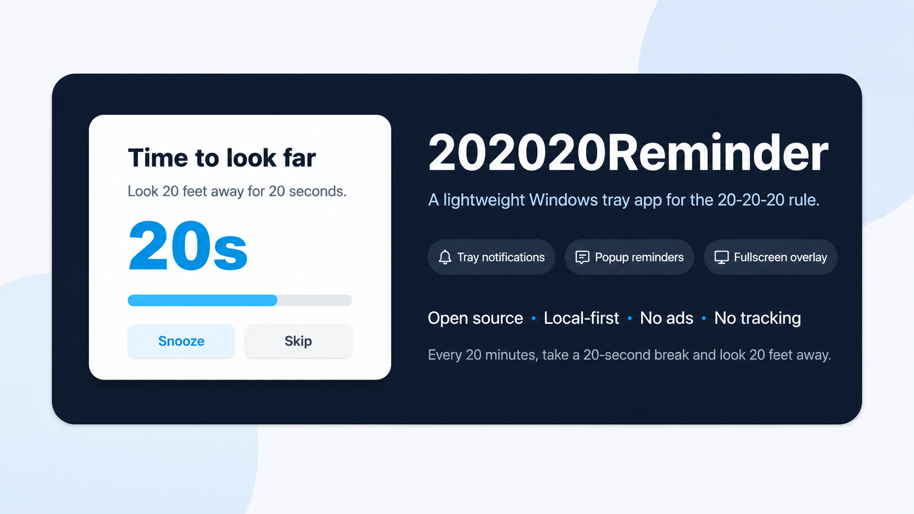
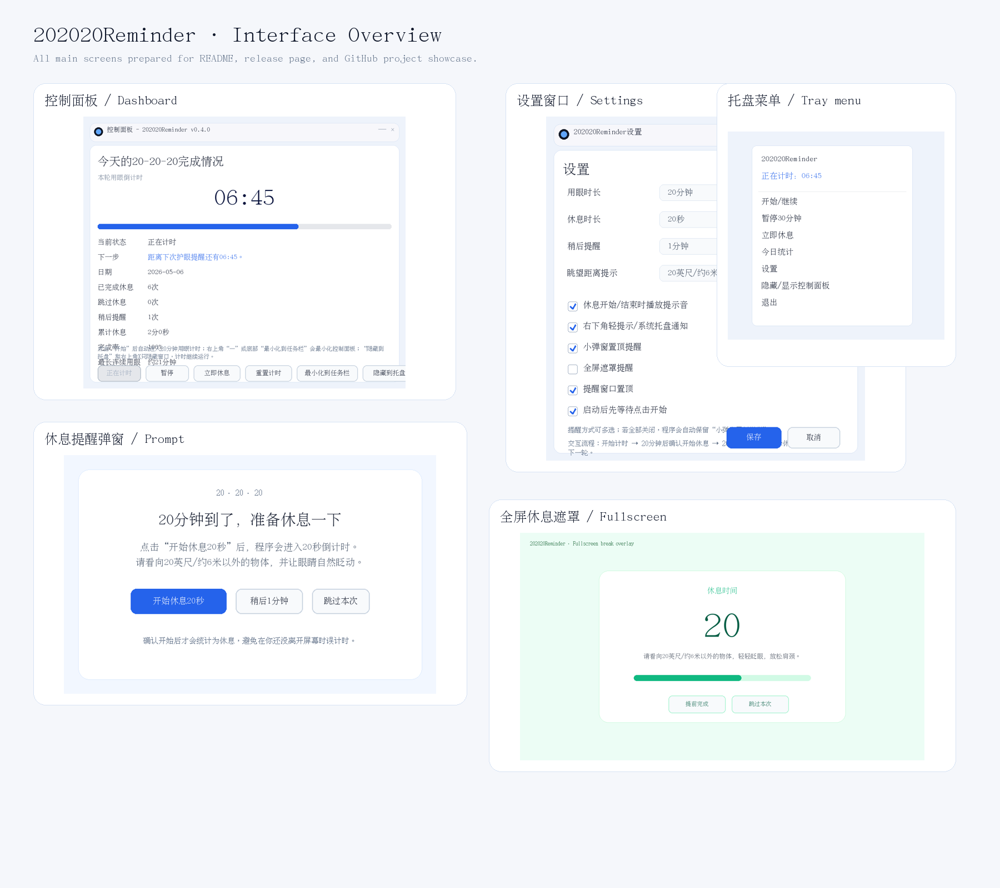
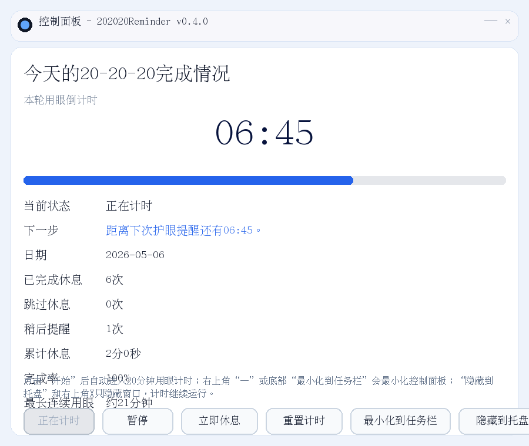
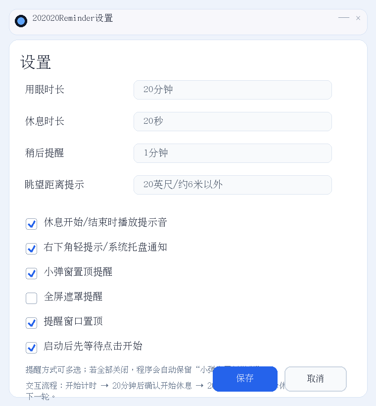
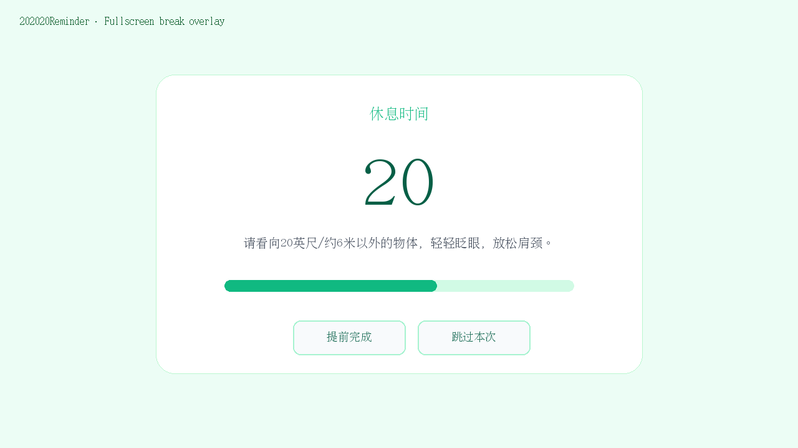

# 202020Reminder

<p align="center">
  
</p>

<p align="center">
  <strong>一款轻量、开源、隐私友好的Windows 20-20-20护眼提醒工具。</strong>
</p>

<p align="center">
  <a href="README.md">English</a> ·
  <a href="README.zh-CN.md">简体中文</a>
</p>

<p align="center">
  
  
  
  
  
  
  
</p>

<p align="center">
  <a href="#下载使用">下载使用</a> ·
  <a href="#界面预览">界面预览</a> ·
  <a href="#功能特性">功能特性</a> ·
  <a href="#开发者快速开始">快速开始</a> ·
  <a href="#roadmap">Roadmap</a> ·
  <a href="#参与贡献">参与贡献</a>
</p>

---

## 为什么做202020Reminder？

长时间盯着屏幕时，人很容易忘记眨眼、忘记看远处、忘记短暂休息。**202020Reminder**希望把20-20-20法则做成一个安静、可靠、打开即用的小工具：

- **轻量简单**：不做复杂健康平台，不需要账号，不依赖云服务
- **系统托盘常驻**：不打扰工作流，需要时再打开控制面板
- **倒计时清晰**：20分钟用眼倒计时+20秒休息倒计时
- **提醒方式灵活**：右下角轻提示、小弹窗置顶、全屏遮罩都支持
- **统计只在本地**：记录今日完成、跳过、稍后、累计休息时间和完成率
- **隐私友好**：无广告、无登录、无埋点、无数据上传

> 说明：本项目不是医疗软件，不能替代专业诊断或治疗。如果长期出现明显眼痛、视物模糊、头痛、飞蚊、闪光感等症状，请及时咨询眼科医生。

---

## 目录

- [202020Reminder](#202020reminder)
  - [为什么做202020Reminder？](#为什么做202020reminder)
  - [目录](#目录)
  - [下载使用](#下载使用)
    - [普通用户](#普通用户)
    - [开发者](#开发者)
  - [界面预览](#界面预览)
    - [所有界面总览](#所有界面总览)
    - [主要界面](#主要界面)
  - [交互流程](#交互流程)
  - [功能特性](#功能特性)
  - [开发者快速开始](#开发者快速开始)
  - [打包Windows可执行文件](#打包windows可执行文件)
  - [项目结构](#项目结构)
  - [Roadmap](#roadmap)
  - [隐私承诺](#隐私承诺)
  - [参与贡献](#参与贡献)
  - [Star支持](#star支持)
  - [开源协议](#开源协议)

---

## 下载使用

### 普通用户

从**GitHub Releases**下载最新的**`202020Reminder.exe`**，双击运行即可。

> 使用打包好的exe不需要安装Python。

### 开发者

使用`uv`运行项目：

```bash
git clone https://github.com/yourname/202020Reminder.git
cd 202020Reminder
uv sync
uv run 202020reminder
```

---

## 界面预览

### 所有界面总览

<p align="center">
  
</p>

### 主要界面

| 控制面板 | 设置窗口 |
|---|---|
|  |  |

| 休息提醒弹窗 | 全屏休息遮罩 |
|---|---|
|  |  |

---

## 交互流程

```text
启动程序
→ 点击开始
→ 进入20分钟用眼倒计时
→ 倒计时到00:00后弹出护眼提醒
→ 点击“开始休息20秒”
→ 进入20秒休息倒计时
→ 休息完成后提示
→ 开始下一轮或暂停
```

202020Reminder采用**确认式休息流程**。20分钟到点后，程序先提醒用户；只有用户点击“开始休息20秒”后，才真正进入休息倒计时。这样可以避免用户还在处理工作时，程序已经把时间误统计为休息。

---

## 功能特性

- Windows系统托盘常驻
- 20分钟用眼倒计时和进度条
- 20秒休息倒计时
- 支持右下角轻提示、小弹窗置顶、全屏遮罩
- 今日本地统计：
  - 已完成休息次数
  - 跳过休息次数
  - 稍后提醒次数
  - 累计休息时间
  - 完成率
  - 最长连续用眼时间
- 可配置：
  - 用眼时长
  - 休息时长
  - 稍后提醒时长
  - 提醒方式
  - 提示音
  - 窗口置顶
- 支持最小化到任务栏和隐藏到托盘
- 基于PySide6实现
- 使用`uv`管理虚拟环境、依赖、测试和打包
- MIT开源协议

---

## 开发者快速开始

先安装`uv`：

```powershell
powershell -ExecutionPolicy ByPass -c "irm https://astral.sh/uv/install.ps1 | iex"
```

运行项目：

```bash
git clone https://github.com/yourname/202020Reminder.git
cd 202020Reminder
uv sync
uv run 202020reminder
```

也可以用模块方式运行：

```bash
uv run python -m twenty_twenty_twenty_reminder
```

运行测试和代码检查：

```bash
uv sync --extra dev
uv run pytest
uv run ruff check .
```

---

## 打包Windows可执行文件

```bash
uv sync --extra dev
uv run pyinstaller --noconsole --onefile --name 202020Reminder --collect-data twenty_twenty_twenty_reminder scripts/run_202020reminder.py
```

打包结果位于：

```text
dist/202020Reminder.exe
```

也可以使用仓库中已经配置好的GitHub Actions，在发布版本时自动生成构建产物。

---

## 项目结构

```text
202020Reminder/
├─ src/twenty_twenty_twenty_reminder/
│  ├─ app.py
│  ├─ config.py
│  ├─ assets/
│  │  └─ icon.svg
│  ├─ __init__.py
│  └─ __main__.py
├─ scripts/
│  └─ run_202020reminder.py
├─ tests/
│  └─ test_config.py
├─ docs/images/
│  ├─ hero.svg
│  ├─ icon.svg
│  └─ screenshots/
├─ .github/
│  ├─ workflows/release.yml
│  └─ ISSUE_TEMPLATE/
├─ pyproject.toml
├─ CONTRIBUTING.md
├─ LICENSE
├─ README.md
└─ README.zh-CN.md
```

---

## Roadmap

- [x] Windows系统托盘常驻
- [x] 20分钟用眼倒计时
- [x] 20秒休息倒计时
- [x] 今日本地统计
- [x] 小弹窗/右下角通知/全屏遮罩提醒
- [x] 控制面板和设置窗口
- [x] 适合GitHub展示的截图和中英文README
- [ ] 开机自启动
- [ ] 系统空闲检测
- [ ] 应用内多语言切换
- [ ] 便携版`.exe`发布
- [ ] 深色模式
- [ ] 全屏应用检测/免打扰模式
- [ ] 暂停30分钟/1小时/2小时
- [ ] 更有正反馈的休息完成提示

---

## 隐私承诺

**202020Reminder不会收集、上传、出售或分享任何数据。**

所有设置和统计信息都只保存在用户本机。没有账号系统，没有广告，没有分析SDK，也没有跟踪行为。

---

## 参与贡献

欢迎提交PR。适合新贡献者的方向包括：

- 修复界面文字或翻译
- 优化README截图
- 为配置和统计逻辑补充测试
- 改进Windows打包流程
- 实现Roadmap中的功能，例如开机自启动、空闲检测、深色模式等

提交PR前建议先运行：

```bash
uv sync --extra dev
uv run pytest
uv run ruff check .
```

如果修改了界面，请尽量附上截图或录屏，方便维护者评审。

更多说明见[CONTRIBUTING.md](CONTRIBUTING.md)。

---

## Star支持

如果这个项目对你有帮助，欢迎给一个Star。它能帮助更多人发现这个轻量、隐私友好的护眼工具。

---

## 开源协议

MIT License。详见[LICENSE](LICENSE)。
